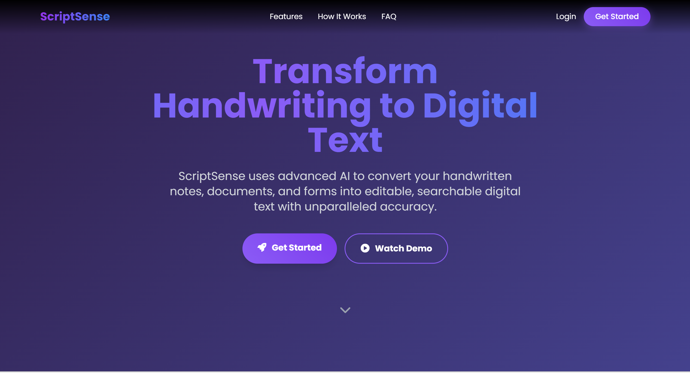
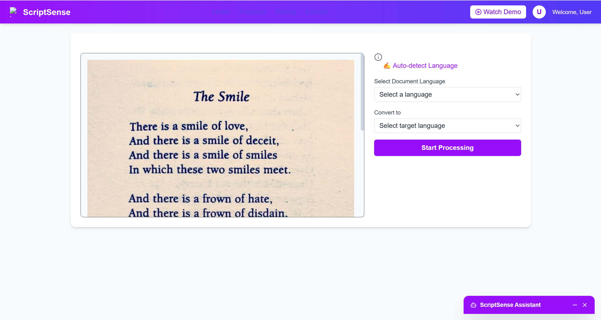
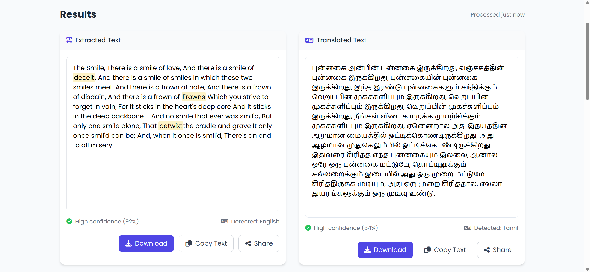

# ScriptSense – Multilingual AI-Powered OCR System

[](https://react.dev/)
[](https://flask.palletsprojects.com/)
[](https://www.python.org/)
[](https://tailwindcss.com/)
[](https://www.sqlite.org/)

**ScriptSense** is a full-stack, end-to-end AI system designed to digitize printed and handwritten text from images. It intelligently routes input through specialized OCR pipelines (PP-OCRv3 for printed text, TrOCR for handwritten), performs multilingual translation, and generates accessible digital formats including audio (TTS) and formatted documents.

This project demonstrates a robust integration of computer vision, Natural Language Processing (NLP), and scalable web application architecture.

---

## Table of Contents
- [Key Capabilities](#key-capabilities)
- [System Architecture](#system-architecture)
- [Tech Stack](#tech-stack)
- [Project Structure](#project-structure)
- [Setup & Installation](#setup--installation)
- [Usage](#usage)
- [Sample Screenshots](#sample-screenshots)
- [Notes on Excluded Files](#notes-on-excluded-files)

---

## Key Capabilities

The system transforms raw image input into structured, usable data through a multi-stage pipeline:

* **Hybrid OCR Engine**: 
    * **Printed Text**: Processed using **PP-OCRv3** for high-speed, high-accuracy extraction.
    * **Handwritten Text**: Processed using **TrOCR** (Transformer-based Optical Character Recognition).
* **Multilingual Support**: Supports English and multiple Indic languages with seamless translation via **IndicTrans2**.
* **Advanced Preprocessing**: Automated noise removal, binarization, and skew correction to handle low-quality real-world images.
* **Intelligent Post-Processing**:
    * **Spello**: For spelling correction.
    * **LanguageTool**: For grammar refinement.
* **Document Generation**: Exports recognized text into downloadable **PDF** and **DOCX** formats with proper font rendering.
* **Text-to-Speech (TTS)**: Converts extracted text into audio for accessibility.
* **Full-Stack Web App**: Secure user authentication (JWT), file management, and a responsive React UI.

---

## System Architecture

The application follows a clean **Client-Server** architecture:

1.  **Frontend (React + Vite)**: Handles user interaction, image uploading, and real-time result visualization.
2.  **Backend (Flask)**: Exposes RESTful APIs to handle OCR inference, translation logic, and file generation.
3.  **Persistence (SQLite)**: Stores user credentials and history (configured for lightweight deployment).
4.  **External Toolkits**: Integrates `IndicTransToolkit` for specialized translation tasks.

---

## Tech Stack

| Component | Technology |
| :--- | :--- |
| **Frontend** | React, Vite, TailwindCSS |
| **Backend** | Flask, Python, SQLAlchemy |
| **OCR Models** | PP-OCRv3 (Printed), TrOCR (Handwritten) |
| **NLP & Translation** | IndicTrans2, Spello, LanguageTool |
| **Database** | SQLite |
| **Authentication** | JWT (JSON Web Tokens) |

---

## Project Structure

```text
ai_ocr_project/
├── IndicTransToolkit/          # External toolkit (installed manually)
├── backend/
│   ├── app/
│   │   ├── static/             # Runtime results generated
│   │   ├── templates/          # Flask templates (kept for structure)
│   │   ├── auth.py
│   │   ├── models.py
│   │   ├── ocr_engine.py
│   │   ├── ocr_router.py
│   │   ├── routes.py
│   │   └── utils.py
│   ├── fonts/                  # NotoSans fonts for multilingual output
│   ├── database/               # SQLite DB (created at runtime)
│   ├── instance/               # Flask runtime config
│   ├── src/
│   │   └── IndicTransToolkit/  # Backend-accessible copy
│   ├── static                  # Runtime outputs (uploads, audio, results)
│   ├── en.pkl
│   ├── hi.pkl
│   ├── config.py
│   ├── run.py
│   └── requirements.txt
├── frontend/
│   ├── src/
│   │   ├── pages/              # Home, Landing, Login, Signup
│   │   ├── components/         # Reuable React UI components
│   │   ├── utils/              # API & auth helpers
│   │   ├── assets/             # Fonts, logo, background video
│   │   ├── App.jsx
│   │   ├── main.jsx
│   │   └── index.css
│   ├── .gitignore
│   ├── eslint.config.js
│   ├── index.html
│   ├── package-lock.json
│   ├── package.json
│   ├── tailwind.config.js      # Tailwind Configuration
│   └── vite.config.js          # Vite Configuration
├── .gitignore
└── README.md
```

---

## Setup & Installation

### Backend Setup

### 1️⃣ Clone the Repository
```bash
git clone [https://github.com/](https://github.com/)<your-username>/scriptsense-ocr.git
cd ai_ocr_project
```

### 2️⃣ Create and Activate Virtual Environment

```bash
# Windows
python -m venv venv
venv\Scripts\activate
```

```bash
# Mac/Linux
python3 -m venv venv
source venv/bin/activate
```

Install Backend Dependencies
```bash
pip install -r backend/requirements.txt
```

### 3️⃣ IndicTrans2 Toolkit Setup (Required)
**Note**: IndicTrans2 is required for multilingual translation but is not included in the git repository. You must install it manually.

The toolkit must exist in two locations for the system to function correctly:

```text
ai_ocr_project/
├── IndicTransToolkit/          <-- Location 1 (Root)
├── backend/
│   └── src/
│       └── IndicTransToolkit/  <-- Location 2 (Backend Source)
```

**Steps to Install**:

1. Clone the toolkit from the official repository:

    https://github.com/AI4Bharat/IndicTrans2

2. Place the cloned folder at the project root: 
```bash
ai_ocr_project/IndicTransToolkit
```

3. Copy that same folder into: 
```bash
ai_ocr_project/backend/src/IndicTransToolkit
```

### 4️⃣ Language Resource Files (Required)
The backend requires pre-generated language resource files (.pkl) for OCR and translation processing. These are excluded from version control.

**Action**: Ensure the following files exist inside the backend/ directory:

```text
backend/
├── en.pkl
└── hi.pkl
```

### 5️⃣ Required Runtime Directories
The following directories are generated at runtime to store uploads and results. If they are not created automatically, please create them manually:

```text
backend/
├── database/
├── static/
│   ├── uploads/
│   ├── audio/
│   └── results/
└── app/
    └── static/
        └── results/
```

### 6️⃣ Run the Backend
```bash
python backend/run.py
```
The backend API will start, exposing endpoints for OCR, translation, and document generation.

## Frontend Setup

### 1️⃣ Install Dependencies
```bash
cd frontend
npm install
```

### 2️⃣ Start the Frontend
```bash
npm run dev
```

---

## Usage

Once both the backend and frontend are running, ScriptSense can be used through the web interface.

### Application Flow

**Open the Web Application**

- Access the frontend in your browser (default Vite URL):
    ```text
    http://localhost:5173
    ```

**User Authentication**

- Sign up for a new account or log in using existing credentials.

- Authentication is handled via the Flask backend.

**Upload Image for OCR**

- Upload an image containing printed or handwritten text.

- Supported use cases include:

    - Scanned documents

    - Photographs of text

    - Multilingual content

**OCR & Processing Pipeline**

- The backend performs:

    - Image preprocessing

    - OCR inference

    - Language-specific processing

    - translation

**View & Export Results**

- OCR results are displayed in the UI.

- Users can:

    - Download results as PDF or DOCX

    - Generate audio output using text-to-speech

**Generated Outputs**

- Files are stored temporarily in runtime directories:
    ```text
    backend/static/results/
    backend/static/audio/
    ```
- These outputs are excluded from version control by design.

---

## Sample Screenshots

Below are representative screenshots from the ScriptSense web application:

### Landing Page


### OCR Upload Interface


### OCR Results & Export Options


---

## Notes on Excluded Files

The following are intentionally excluded from Git:

- SQLite database files

- Uploaded images and generated outputs

- External toolkits (IndicTrans2)

- Serialized language artifacts (.pkl)

- Node modules

---


